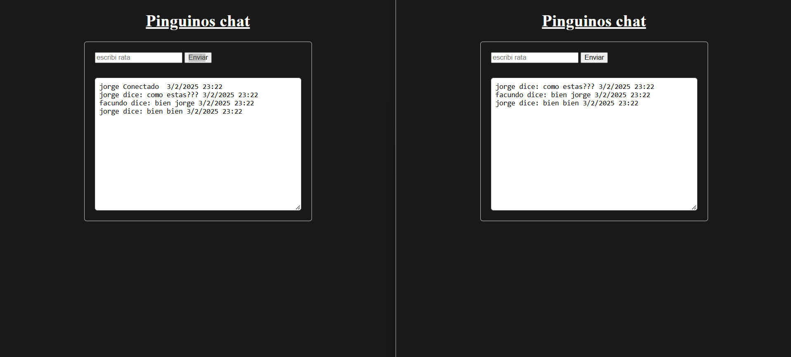

Necesitas:

node.js v19

docker ultima version

Preparación de la aplicación:

Asegúrate de tener de clonar este directorio en tu maquina local 

Construcción de la imagen Docker:

Desde la línea de comandos, en el directorio donde se encuentra tu Docker-Compose, ejecuta el siguiente comando para construir la imagen Docker-compose:

              docker-compose build

Ejecución del contenedor:

Una vez que la imagen se haya construido correctamente, puedes ejecutar un contenedor con el siguiente comando

              docker-compose up

Despues habrir en el puerto http://localhost:8080 todos los clientes que queramos

Los datos se persisten en la bdd MongoDB

